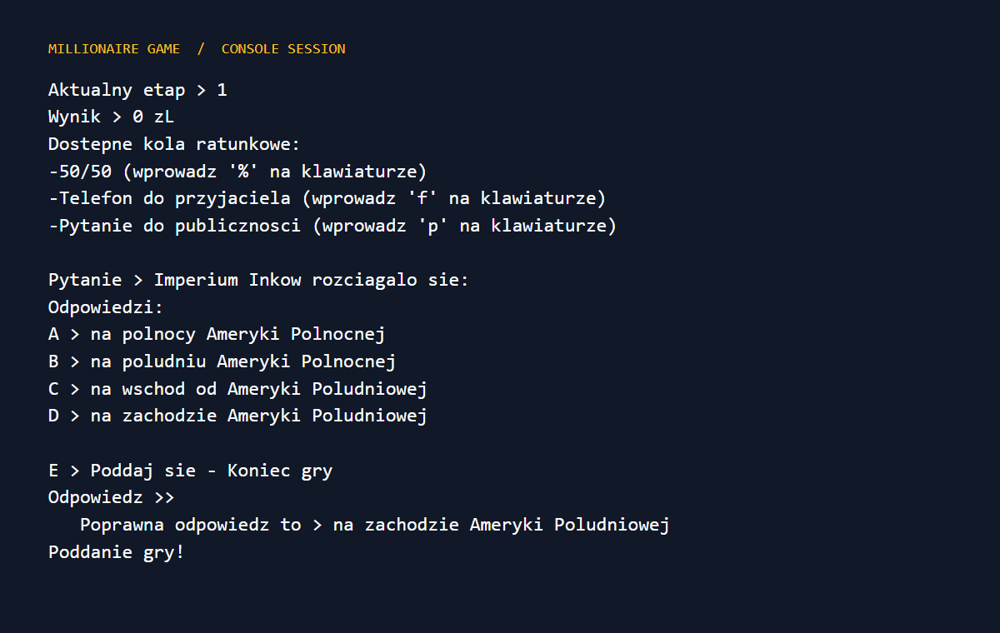

# 💰 Millionaire Game

[](https://isocpp.org/)
[](https://github.com/Kamilr616/Millionaire_Game/actions/workflows/ci.yml)
[](https://github.com/Kamilr616/Millionaire_Game/releases/latest)
[](LICENSE)

> 🇵🇱 [Polish version](README.pl.md)

> 🗓️ **Project period:** 2022

> 📘 [Technical documentation](docs/TECHNICAL_DOCUMENTATION.md)

A console implementation of the classic **"Who Wants to Be a Millionaire?"** quiz game, written in C++. Answer one question at each of 15 levels, use your lifelines wisely, and win the (virtual) million!

<p align="center">
  
</p>

## ✨ Features

- ❓ **15 question levels** — validated question pools loaded from CSV files (`questions/1.csv` … `15.csv`), easy to extend with your own questions
- 🛟 **Three lifelines** — *50:50* (removes two wrong answers), *phone a friend*, and *ask the audience*
- 📊 **Prize tracking** — current level, prize and give-up option (walk away with your winnings)
- ⚙️ **Settings menu** — e.g. toggle revealing the correct answer
- 🖥️ Lightweight, dependency-free console UI

## 🎮 How to play

After launching the game you'll see the main menu:

| Key | Action |
|-----|--------|
| `1` | New game |
| `2` | Settings |
| `0` | Exit |

During the game the available lifelines are shown at the top, followed by the question and four answers labelled `A`–`D`. Pick the right letter to advance; a wrong answer (or giving up) ends the game. Answer all questions to win the million!

| In-game key | Action |
|-------------|--------|
| `A`–`D` (or `a`–`d`) | Select an answer |
| `%` | Use 50:50 |
| `f` | Phone a friend |
| `p` | Ask the audience |
| `E` or `e` | Give up |

```text
Gra milionerzy
1. Nowa gra
2. Ustawienia programu
0. Zakoncz

Aktualny etap > 1
Wynik > 0 zL
Dostepne kola ratunkowe:
-50/50 (wprowadz '%' na klawiaturze)
-Telefon do przyjaciela (wprowadz 'f' na klawiaturze)
-Pytanie do publicznosci (wprowadz 'p' na klawiaturze)

Pytanie > Kandydat na wysokie stanowisko czesto nie musi miec odpowiednich kwalifikacji, o ile ma mocne:
Odpowiedzi:
A > lydki
B > kolana
C > plecy
D > rece

E > Poddaj sie - Koniec gry
Odpowiedz >> C
Dobrze!

   Poprawna odpowiedz to > plecy
Wygrales 100 zl
```

## 📋 Question format

Questions live in `questions/<level>.csv` — one file per difficulty level — as semicolon-separated rows:

```csv
ID;QUESTIONS;ANSWER1;ANSWER2;ANSWER3;ANSWER4;CORRECT_ANSWER
1;Which muscle should a candidate have strong?;calves;knees;back;arms;3
```

`CORRECT_ANSWER` is the index (1–4) of the correct answer. The loader validates the exact header and every non-empty row before randomly selecting a question. Add your own questions by appending rows.

## 📂 Repository structure

| Path | Description |
|------|-------------|
| `main.cpp` | Entry point and game loop |
| `stage.{hpp,cpp}` | Game stage, prize ladder and guaranteed payouts |
| `question.{hpp,cpp}` | Question model and CSV loading |
| `global.hpp` | Shared definitions |
| `questions/*.csv` | Question banks per difficulty level |

## 🚀 Building

```bash
git clone https://github.com/Kamilr616/Millionaire_Game.git
cd Millionaire_Game
g++ -std=c++17 main.cpp stage.cpp question.cpp -o millionaire
./millionaire
```

> The `questions/` directory must be next to the executable at runtime.

### Tests

```bash
g++ -std=c++17 tests/game_tests.cpp stage.cpp question.cpp -I. -o millionaire-tests
./millionaire-tests
```

GitHub Actions runs the same build and regression tests on every push and pull request.

## 👥 Team

| Member | Contribution |
|--------|--------------|
| **Kamil Rataj** | Repository setup, programming |
| **Kacper Krzyżkowski** | Programming |
| **Tomasz Porwisz** | Question authoring & proofreading, documentation |

## 📄 License

This project is licensed under the [MIT License](LICENSE).

## 👤 Author

**Kamil Rataj** — [GitHub](https://github.com/Kamilr616) · [LinkedIn](https://www.linkedin.com/in/kamil-r-153ab7121/)
