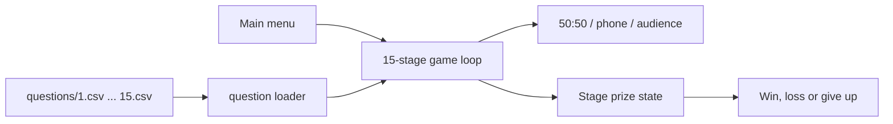

# Technical documentation

## Scope

Millionaire Game is a dependency-free C++17 console quiz. A run selects one
question from each of 15 level-specific CSV banks, manages the prize ladder and
allows each of three lifelines to be used once.



## Source structure

| Component | Responsibility |
|---|---|
| `main.cpp` | Menu, settings and the main game loop. |
| `question.cpp` | CSV loading, question interaction and lifeline algorithms. |
| `stage.cpp` | Current level, prize and guaranteed-threshold payout. |
| `global.hpp` | Shared console/platform helpers. |
| `questions/` | Fifteen semicolon-separated question banks. |
| `tests/game_tests.cpp` | Loader, lifeline and payout regression checks. |

The executable changes its working directory to the directory containing the
binary. Consequently a deployed binary must have the `questions/` directory next
to it.

## Question-bank format

Each non-header row must contain exactly seven semicolon-separated fields:

```text
id;question;answer A;answer B;answer C;answer D;correct index
```

The ID must be a positive integer and the correct index must be a strict integer
from 1 to 4 corresponding to A through D. The exact header is required, field
whitespace is trimmed, empty lines are skipped, and every non-empty row is
validated before selection. A malformed row reports its file and line number.
The parser is a simple delimiter split: it does not support quoted fields or
semicolons inside a question/answer and does not perform full RFC 4180 parsing.

After successful validation, one row is selected with the C library
pseudo-random generator. The generator is seeded from the current time when the
game starts.

## Game state and payouts

The prize values after correct answers are:

```text
100, 200, 300, 500, 1,000,
2,000, 4,000, 8,000, 16,000, 32,000,
64,000, 125,000, 250,000, 500,000, 1,000,000
```

The guaranteed thresholds are 1,000 after question 5 and 32,000 after question
10. A wrong answer pays 0 at levels 1-5, 1,000 at levels 6-10 and 32,000 from
level 11 onward. Giving up returns the currently displayed prize. Completing all
15 questions returns 1,000,000. A completed result resets the `Stage` object.

## Lifelines

- **50:50** randomly replaces two incorrect displayed answers with blanks.
- **Phone a friend** always suggests the correct answer for the first five
  questions; later it uniformly selects one of the still visible answers.
- **Ask the audience** assigns 50-80% to the correct answer and distributes the
  remainder over visible incorrect answers. Percentages are adjusted to total
  exactly 100.

Each lifeline is tracked by the game loop and can be used once. The optional
“show answer” setting is a demonstration/debug aid and reveals the correct
answer before input.

## Build and tests

Compile the game as separate translation units:

```bash
g++ -std=c++17 main.cpp stage.cpp question.cpp -o millionaire
```

Do not include `.cpp` files from one another; doing so creates duplicate
definitions when normal compilation is used. Run from the directory containing
the `questions/` folder.

The standalone test program can be built and run with:

```bash
g++ -std=c++17 -I. tests/game_tests.cpp stage.cpp question.cpp -o millionaire-tests
./millionaire-tests
```

Tests validate every question bank, reject malformed fields and indices, verify
50:50 and phone-a-friend after 50:50, repeatedly assert that audience percentages
total 100, and cover every prize and guaranteed-payout boundary. GitHub Actions
builds the game and runs the suite with GCC and sanitizers on Ubuntu.

## Limitations

- Console text and question banks are Polish and rely on terminal encoding.
- The delimiter parser does not support escaping or quoted semicolons.
- `rand()` is suitable for gameplay variation, not security-sensitive draws.
- Question interaction uses bounded recursive re-entry after lifelines; ordinary
  invalid input is handled iteratively.
- There is no project build system. CI covers GCC on Ubuntu, while interactive
  console behavior is not automatically tested across multiple platforms.
