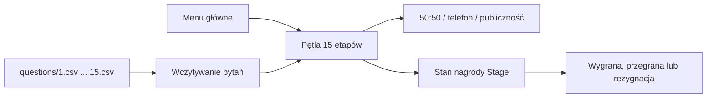

# Dokumentacja techniczna

## Zakres

Millionaire Game jest konsolowym quizem C++17 bez zewnętrznych zależności. Rozgrywka
losuje po jednym pytaniu z 15 plików poziomów, prowadzi drabinkę nagród i pozwala
jednorazowo użyć każdego z trzech kół ratunkowych.



## Struktura źródeł

| Komponent | Odpowiedzialność |
|---|---|
| `main.cpp` | Menu, ustawienia i główna pętla gry. |
| `question.cpp` | Wczytywanie CSV, interakcja i algorytmy kół ratunkowych. |
| `stage.cpp` | Bieżący poziom, nagroda i wypłata gwarantowana. |
| `global.hpp` | Wspólne funkcje konsoli i platformy. |
| `questions/` | Piętnaście banków pytań rozdzielanych średnikiem. |
| `tests/game_tests.cpp` | Testy loadera, kół i wypłat. |

Program zmienia katalog roboczy na katalog pliku wykonywalnego. W dystrybucji
folder `questions/` musi więc leżeć obok programu.

## Format banku pytań

Każdy wiersz poza nagłówkiem musi mieć siedem pól:

```text
id;pytanie;odpowiedź A;odpowiedź B;odpowiedź C;odpowiedź D;indeks poprawnej
```

ID musi być dodatnią liczbą całkowitą, a indeks poprawnej odpowiedzi ścisłą
liczbą od 1 do 4 odpowiadającą literom A-D. Wymagany jest dokładny nagłówek,
białe znaki przy polach są usuwane, puste wiersze pomijane, a każdy niepusty
wiersz jest walidowany przed losowaniem. Błąd wskazuje plik i numer wiersza.
Parser jedynie dzieli po średniku: nie obsługuje cytowanych pól, średnika w
treści ani pełnego standardu RFC 4180.

Po poprawnej walidacji wybierany jest jeden wiersz przy użyciu generatora
pseudolosowego biblioteki C, inicjalizowanego bieżącym czasem.

## Stan gry i wypłaty

Nagrody po poprawnych odpowiedziach wynoszą:

```text
100, 200, 300, 500, 1 000,
2 000, 4 000, 8 000, 16 000, 32 000,
64 000, 125 000, 250 000, 500 000, 1 000 000
```

Progi gwarantowane to 1 000 po pytaniu 5 i 32 000 po pytaniu 10. Błąd na
poziomach 1-5 daje 0, na 6-10 daje 1 000, a od 11 daje 32 000. Rezygnacja zwraca
bieżącą nagrodę. Ukończenie 15 pytań daje 1 000 000. Po zakończeniu obiekt `Stage`
jest resetowany.

## Koła ratunkowe

- **50:50** losowo zastępuje dwa błędne warianty pustym tekstem.
- **Telefon do przyjaciela** dla pierwszych pięciu pytań zawsze wskazuje poprawną
  odpowiedź, a później równomiernie losuje jedną z nadal widocznych.
- **Pytanie do publiczności** przydziela poprawnej odpowiedzi 50-80%, rozdziela
  resztę między widoczne błędne i koryguje sumę do dokładnie 100%.

Pętla gry pozwala użyć każdego koła raz. Opcja pokazywania odpowiedzi jest pomocą
demonstracyjną/debug i ujawnia poprawny wariant przed wyborem.

## Budowanie i testy

Źródła trzeba kompilować jako osobne jednostki:

```bash
g++ -std=c++17 main.cpp stage.cpp question.cpp -o millionaire
```

Nie należy dołączać plików `.cpp` przez `#include`, ponieważ przy normalnym
buildzie powoduje to wielokrotne definicje. Program uruchamia się z folderem
`questions/` obok pliku wykonywalnego.

Testy:

```bash
g++ -std=c++17 -I. tests/game_tests.cpp stage.cpp question.cpp -o millionaire-tests
./millionaire-tests
```

Testy walidują każdy bank, odrzucają błędne pola i indeksy, sprawdzają 50:50 oraz
telefon po 50:50, wielokrotnie potwierdzają sumę 100% głosów publiczności i
obejmują każdą nagrodę oraz granicę wypłaty gwarantowanej. GitHub Actions buduje
grę i uruchamia zestaw z GCC oraz sanitizerami na Ubuntu.

## Ograniczenia

- Tekst konsoli i banki są polskie i zależą od kodowania terminala.
- Parser nie obsługuje escaping ani cytowanych średników.
- `rand()` nadaje się do urozmaicenia gry, ale nie do losowań bezpieczeństwa.
- Obsługa pytań korzysta z ograniczonego ponownego wejścia rekurencyjnego po
  użyciu koła; zwykłe błędne wejście jest obsługiwane iteracyjnie.
- Brak systemu budowania projektu. CI obejmuje GCC na Ubuntu, ale interaktywne
  zachowanie konsoli nie jest automatycznie testowane na wielu platformach.
